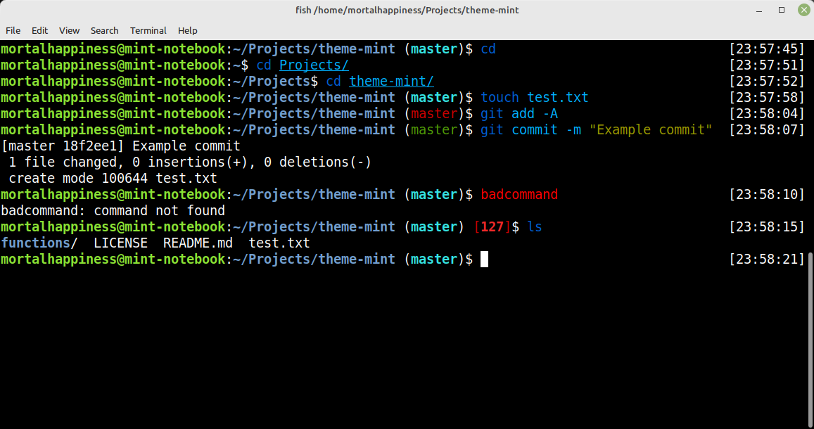

#### mint fish theme
> A theme for [Oh My Fish][omf-link].

[](/LICENSE)
[](https://fishshell.com)
[](https://www.github.com/oh-my-fish/oh-my-fish)

<br />


## Install

```fish
omf install mint
```


## Features

* When not in git folder, looks exactly the same as the default Linux Mint bash $PS1
* When in git folder
  * Show red branch name when the working directory is dirty
  * Show green branch name when all files are in the staging area
  * Show bold cyan branch name when the working directory is clean
* Show red status code when the previous command has error
* Display hostname in red when in a SSH session
* Show current timestamp on the right prompt

## Screenshot

<p align="center">
  
</p>

## Credits

* Based on https://github.com/ribugent/theme-gentoo and modified to follow Linux Mint default bash $PS1
* Git status function modified from https://github.com/oh-my-fish/theme-gitstatus
* [Linux Mint](https://linuxmint.com/) is a Linux distribution.

# License

[MIT][mit] © [MortalHappiness][author]


[mit]:            https://opensource.org/licenses/MIT
[author]:         https://github.com/{{USER}}
[omf-link]:       https://www.github.com/oh-my-fish/oh-my-fish

[license-badge]:  https://img.shields.io/badge/license-MIT-007EC7.svg?style=flat-square
